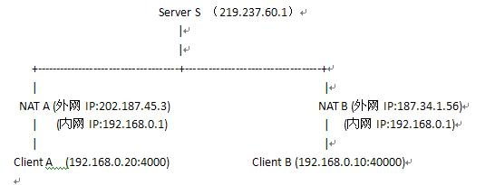
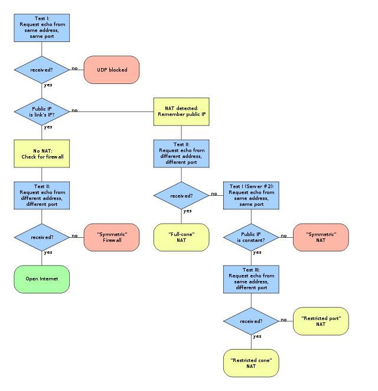

# 端口映射
基于端口映射实现内网穿透等功能

[udp打洞/p2p穿透/种子 详解](https://www.cnblogs.com/LittleHann/p/5556185.html)

使用frp软件进行内网穿透/p2p, 配置参考官网 [frp](https://github.com/fatedier/frp/blob/master/README.md).
- 内网穿透用于登录等小流量高网速操作, p2p 用于传输大文件

frp 可以通过编写脚本实现由 systemd 管理, 脚本编写方式参考 [systemd](/soft/systemd.md#systemd脚本), 脚本参考 [frpc](./service/frpc.service) [frps](./service/frps.service)

配置示例如下

```INI
# frpc
[common]
server_addr = xxx
server_port = 6000

[ssh_pc]
type = tcp
local_ip = 127.0.0.1
local_port = 22
remote_port = xxx

# smb 客户端配置
[p2p_smb_visitor]
type = xtcp
role = xxx
server_name = p2p_smb
# 只有 sk 一致的用户才能访问到此服务
sk = xxxxx
bind_addr = 127.0.0.1
bind_port = 445

# smb 服务端配置, 提供数据的一方
[p2p_ssh]
type = xtcp
sk = xxxxx
local_ip = 127.0.0.1
local_port = 445
```

```INI
# frps
[common]
bind_port = 6000
# p2p 需要开通 udp 端口
bind_udp_port = 7000
```

## 引用
### UDP打洞、P2P组网方式研究
> 地址: https://www.cnblogs.com/LittleHann/p/5556185.html

1. NAT概念
2. P2P概念
3. UDP打洞
4. P2P DEMO
5. ZeroNet P2P

----
NAT概念

在STUN协议中，根据内部终端的地址(LocalIP:LocalPort)到NAT出口的公网地址(PublicIP:PublicPort)的影射方式，把NAT分为四种类型(rfc3489: http://www.ietf.org/rfc/rfc3489.txt)
1. Full Cone: 这种NAT内部的机器A连接过外网机器C后，NAT会打开一个端口，然后外网的任何发到这个打开的端口的UDP数据报都可以到达A。不管是不是C发过来的(NAT源端口映射)
2. Restricted Cone: 这种NAT内部的机器A连接过外网的机器C后，NAT打开一个端口，然后C可以用任何端口和A通信，其他的外网机器不行(目的IP映射)
3. Port Restricted Cone: 这种NAT内部的机器A连接过外网的机器C后，NAT打开一个端口，然后C可以用原来的端口和A通信，其他的外网机器不行(NAT目的端口映射)
4. Symmetic: 对于这种NAT.连接不同的外部目标。原来NAT打开的端口会变化，而Cone NAT不会，虽然可以用端口猜测，但是成功的概率很小

或者分为2类
1. 基本的NAT: 一个私有网络(域)中的节点中只有很少的节点需要与外网连接。那么这个子网中其实只有少数的节点需要全球唯一的IP地址，其他的节点的IP地址应该是可以重用的。因此，基本的NAT实现的功能很简单，在子网内使用一个保留的IP子网段，这些IP对外是不可见的。子网内只有少数一些IP地址可以对应到真正全球唯一的IP地址。如果这些节点需要访问外部网络，那么基本NAT就负责将这个节点的子网内IP转化为一个全球唯一的IP然后发送出去(基本的NAT会改变IP包中的原IP地址，但是不会改变IP包中的端口)
2. NAPT(Network Address/Port Translator): NAPT不但会改变经过这个NAT设备的IP数据报的IP地址，还会改变IP数据报的TCP/UDP端口
  - 如果Client A想向Client B发送信息，那么Client A发送命令给Server S，请求Server S命令Client B向Client A方向打洞
  - 如果Client B想向Client A发送信息，那么Client B发送命令给Server S，请求Server S命令Client A向Client B方向打洞

总体来说，P2P(NAT环境下)的通信都是被动反向的，即谁想向谁发送数据，需要通知对方向自己"打洞"

---
P2P概念

P2P是peer-to-peer的缩写，peer在英语里有"(地位、能力等)同等者"、"同事"和"伙伴"等意义。这样一来，P2P也就可以理解为"伙伴对伙伴"的意思，或称为对等联网，简单的说，P2P直接将人们联系起来，让人们通过互联网直接交互。P2P使得网络上的沟通变得容易、更直接共享和交互，真正地消除中间商。P2P就是人可以直接连接到其他用户的计算机、交换文件，而不是像过去那样连接到服务器去浏览与下载。P2P另一个重要特点是改变互联网现在的以大网站为中心的状态、重返“非中心化”，并把权力交还给用户

事实上，网络上现有的许多服务可以归入P2P的行列。即时讯息系统譬如ICQ、AOL Instant Messenger、Yahoo Pager、微软的MSN Messenger以及国内的OICQ是最流行的P2P应用

普通的直连式P2P实现


STUN方式的P2P实现

STUN是RFC3489规定的一种NAT穿透方式，STUN的探测过程需要有一个公网IP的STUN server，在NAT后面的UAC必须和此server配合，互相之间发送若干个UDP数据包。UDP包中包含有UAC需要了解的信息，比如NAT外网IP，PORT等等。UAC通过是否得到这个UDP包和包中的数据判断自己的NAT类型，假设如下场景
1. UAC(B): UAC的IP为IPB
2. NAT(A): NAT的IP为IPA
3. SERVER(C): SERVER的IP为IPC1 、IPC2
  - 服务器C有两个IP

NAT的探测过程


---
P2P文件传输协议之BitTorrent协议

Bittorrent与其他传统P2P软件如Gnutella,Fasttrack不同,Bittorrent只是一个纯粹的文件下载协议,并提供搜索功能,所以往往资源的获取要跟其他一些应用结合起来,比如说发布Bittorrent种子信息的网站

*Bittorrent工作原理*

Bittorrent的工作原理其实很简单,他就是将一份数据分隔成256K大小的数据分组,并在Bittorrent 网络中一群用户相互协作完成这些数据的分发,用户参与数据分发的信息已文件的形式存储,一般可以通过web网站获取这些信息但是实际数据传输依靠的不是Http协议,而是由专门的P2P协议来完成,这些对于用户都是透明的

普通的HTTP/FTP下载使用TCP/IP协议,BitTorrent协议是架构于TCP/IP协议之上的一个P2P文件传输协议,处于TCP/IP结构的应用层｡ BitTorrent协议本身也包含了很多具体的内容协议和扩展协议,并在不断扩充中

根据BitTorrent协议,文件发布者会根据要发布的文件生成提供一个.torrent文件,即种子文件,也简称为“种子"｡ .torrent文件本质上是文本文件,包含Tracker信息和文件信息两部分

1. Tracker信息主要是BT下载中需要用到的Tracker服务器(中间人服务器)的地址，以及针对Tracker服务器的设置
2. 文件信息是根据对目标文件的计算生成的计算结果根据BitTorrent协议内的B编码规则进行编码，它的主要原理是需要把提供下载的文件虚拟分成大小相等的块，块大小必须为2k的整数次方(由于是虚拟分块,硬盘上并不产生各个块文件)，并把每个块的索引信息和Hash验证码写入.torrent文件中
3. 所以,.torrent文件就是被下载文件的"索引"

*种子文件结构*
一个种子文件，通常是以.torrent后缀结尾。BitTorrent协议规定，torrent文件本身，内容必须是utf8编码格式，并且其中的字段结构采用bencoding编码格式

Torrent种子文件由两部分组成：announce(tracker url)和文件信息，该种子文件的一部分如下，根据bencoding编码格式，把这段字符解码还原后

````
announce:http://www.chinahdtv.org/announce.php?passkey=6e7a1c7ca4164d87e9b0e00ec63aa749
created by:uTorrent/2040
creation date:1369699038
encoding:UTF-8
info:
{files:[
{length:158784,path:[Iron.Man.3.2013.HDSCR.ULTRA.EDiTiON.720p.x264.chn.srt]}, {length:107117,path:[Iron.Man.3.2013.HDSCR.ULTRA.EDiTiON.720p.x264.chn1.srt]}, {length:93644,path:[Iron.Man.3.2013.HDSCR.ULTRA.EDiTiON.720p.x264.chn2.srt]},
{length:4272200020,path:[Iron.Man.3.2013.HDSCR.ULTRA.EDiTiON.720p.x264.mkv]}],
name:钢铁侠3.Iron.Man.3.2013.HDSCR.ULTRA.EDiTiON.720p.x264,
piece length:4194304,
pieces:P1,P2,P3...P1019
private:1
source:[hd.gg] CNHD ChinaHDTV
}

// 解释
1. tracker地址，这里就是announce后面的url
2. 种子创建软件及其版本号，这里是uTorrent软件创建的，版本号为2040
3. 创建日期，这里是1369699038，这个数字显示的是从UTC 1970-1-1 00:00:00到到现在所经历的秒数
4. 编码格式，这里是UTF-8(codepage=936)
5. info区，这里指定的是该种子有几个文件，文件有多长，目录结构，以及目录和文件的名字
6. Name字段，指定顶层目录名字
7. 每个段的大小，Bittorrent协议是把一个文件分成很多个小段，然后分段下载的，这个地方就是指定每个段的大小，单位是字节，这里每个段的大小大约为4MB(4194304)
8. 段哈希值，就是整个种子中，每个段的SHA1哈希值拼在一起，每个段的哈希长度是固定的，20个字符，所以pieces后面跟的那个数字20380其实是段数量*20，如果你用20380除以20，就会发现这个种子段数量为1019，乘上前面的段大小，这个种子大概有4GB大小，也就是说你把这个种子下载完后，占硬盘4GB空间
9. private值，这个属性主要显示这个种子是私有的，还是公有的。一般那些各大PT站就是私有的。私有的种子会禁掉DHT(distributed hash table)，因为如果你的client开这个功能，那就会跳过tracker来和其他peer进行数据交换，在很多PT内站(CHDbits,CMCT,CNHD)把这种行为称为作弊，会直接ban掉你在PT站上的帐号
10. 源，显示该种子的来源，这里是CNHD
````
*BitTorrent通信流程与网络包结构*

http://www.cnblogs.com/LittleHann/p/3837839.html

*BitTorrent下载*

下载者要下载文件内容,需要先得到相应的.torrent文件,然后使用BT客户端软件进行下载(读取.torrent文件中的索引)
1. 下载时,BT客户端首先解析.torrent文件得到Tracker地址,然后连接Tracker服务器
2. Tracker服务器回应下载者的请求,提供下载者其他下载者(包括发布者)的IP(相当于打洞过程)
3. 下载者再连接其他下载者
4. 根据.torrent文件,两者分别对方告知自己已经有的块,然后交换对方没有的数据
5. 此时不需要其他服务器参与,分散了单个线路上的数据流量,因此减轻了服务器负担(打洞完成后，不再需要中间人服务器的参与，通信双方直接进行点对点通信)
6. 下载者每得到一个块,需要算出下载块的Hash验证码与.torrent文件中的对比,如果一样则说明块正确,不一样则需要重新下载这个块，这种规定是为了解决下载内容准确性的问题

一般的HTTP/FTP下载,发布文件仅在某个或某几个服务器,下载的人太多,服务器的带宽很易不胜负荷,变得很慢，而BitTorrent协议下载的特点是,下载的人越多,提供的带宽也越多,种子也会越来越多,下载速度就越快

相关: 
http://www.2cto.com/net/200506/5494.html
http://www.cppblog.com/peakflys/archive/2013/01/25/197562.html
http://blog.chinaunix.net/uid-11572501-id-2868679.html
https://github.com/Martiusweb/p2p
http://network.51cto.com/art/201006/207932.htm
http://blog.csdn.net/wengpingbo/article/details/9174363
https://github.com/axeliux/P2P


---
UDP打洞

流程
1. 首先，Client A登录服务器，NAT A为这次的Session分配了一个端口60000，那么Server S收到的Client A的地址是202.187.45.3:60000，这就是Client A的外网地址了
2. 同样，Client B登录Server S，NAT B给此次Session分配的端口是40000，那么Server S收到的B的地址是187.34.1.56:40000
3. 此时，Client A与Client B都可以与Server S通信了。如果Client A此时想直接发送信息给Client B，那么他可以从Server S那儿获得B的公网地址187.34.1.56:40000，但是Client A不能直接向这个地址发送信息，因为如果这样发送信息，NAT B会将这个信息丢弃(因为这样的信息是不请自来的，为了安全，大多数NAT都会执行丢弃动作)。现在我们需要的是在NAT B上打一个方向为202.187.45.3(即Client A的外网地址)的洞，那么Client A发送到187.34.1.56:40000的信息,Client B就能收到了。这个打洞命令由谁Server S来发出(Server S只是作为一个中转代理)
4. 总结一下这个过程：如果Client A想向Client B发送信息，那么Client A发送命令给Server S，请求Server S命令Client B向Client A方向打洞。然后Client A就可以通过Client B的外网地址与Client B通信了

需要注意
1. 在NAT模式下，内网的IP是不能被外网直接正向访问到的，只能又内网IP向外网IP主动发起连接，一旦连接成功建立起来，后续的交互通信是完全正常的
2. 而P2P要面对的问题就是两个IP都在NAT内网中，谁也无法率先发起连接(NAT会拒绝"不请自来"的外网连接)，所以需要事先在"中间人(Server S)"上进行登记，登记的内容为对应的NAT公网IP:PORT
3. 如果某个NAT内网IP需要向另一个NAT内网IP进行通信，需要"通知"中间人Server S，由它转发来告知目标NAT IP主动向自己主动发起连接，这谓之"打洞"，"打洞"完成后，当前NAT就记录了当前NAT IP和目标NAT外网IP的的会话记录了，而此时对于对方的NAT来说，同样也记录一个会话，解决了"鸡生蛋，蛋生鸡"的问题后，此后，两个NAT内网IP就可以互相开始正常通信了

---
后续稍后再改
